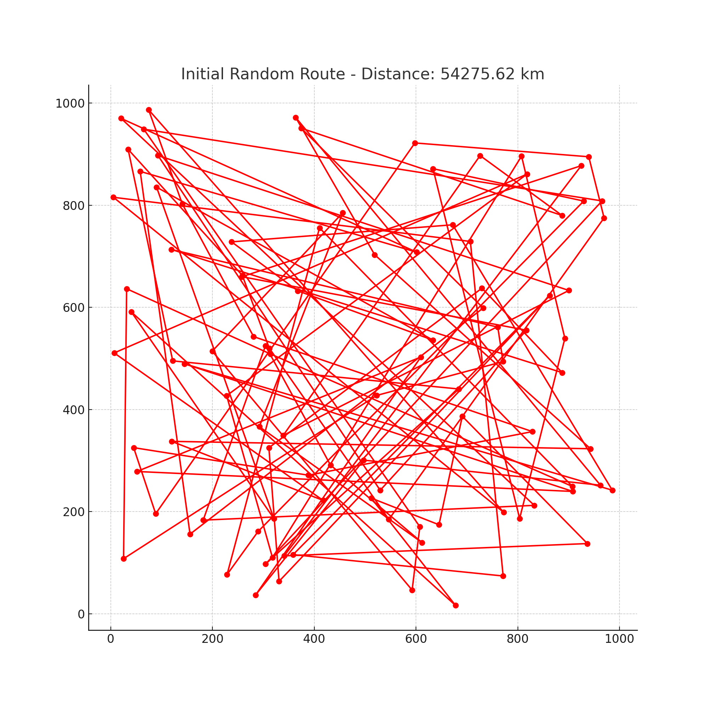
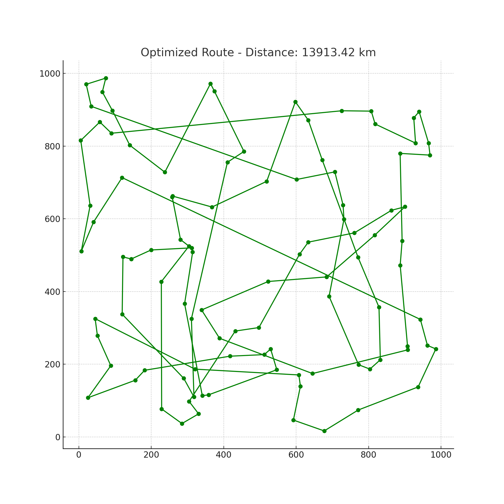
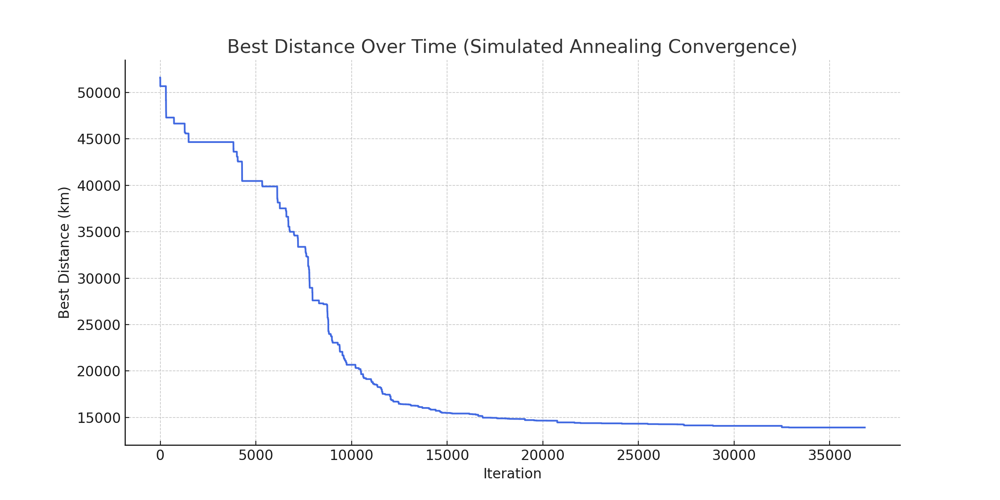

# Route Optimization using Simulated Annealing

This repository demonstrates how to optimize delivery routes using Simulated Annealing (SA) in Python. It solves a 100-city Traveling Salesman Problem (TSP) using a powerful metaheuristic.

## 📊 What’s Inside

- `src/route_optimization.py`: Full Python code for generating random cities, running SA, and visualizing results.
- `images/`: Contains output plots like initial route, optimized route, and convergence plot.
- `README.md`: You're reading it!

## 🚀 How to Run

```bash
cd src
python route_optimization.py
```

The images will be saved inside `images/`.

## 📈 Sample Outputs

| Initial Route | Optimized Route | Convergence Plot |
|---|---|---|
|  |  |  |

## 🔗 About

This project is a great template for data scientists looking to apply metaheuristics to real-world problems like logistics optimization, delivery routing, and vehicle scheduling.

